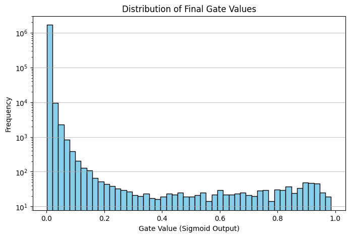

# Report: The Self-Pruning Neural Network

### 1. How the L1 Penalty Encourages Sparsity
The L1 regularization norm calculates the sum of the absolute values of the parameters. Unlike standard L2 regularization (which applies a shrinking penalty that diminishes as weights get closer to zero), the L1 penalty exerts a **constant gradient force** pushing the parameter toward zero, regardless of its current size. 

Because our gates are the output of a `sigmoid` function, their values are strictly bounded between 0 and 1. During backpropagation, the optimizer continuously penalizes any non-zero gate value. The only way for the network to minimize this specific sparsity loss term is to drive the underlying `gate_scores` into deep negative numbers. This pushes the resulting `sigmoid` output exactly to zero, effectively pruning the corresponding connection from the network.

### 2. Results Summary
The following results were obtained by training the custom feed-forward network on CIFAR-10 for 10 epochs using the Adam optimizer.

| Lambda ($\lambda$) | Test Accuracy | Sparsity Level (%) |
| :--- | :--- | :--- |
| **0.0** (Baseline) | 46.03% | 0.00% |
| **0.0001** (Low) | 53.24% | 97.62% |
| **0.001** (High) | 51.32% | 99.91% |

**Observation:** The $\lambda = 0.0001$ model demonstrates the optimal sparsity-vs-accuracy trade-off. By aggressively pruning nearly 98% of the noisy weights, the network generalized better and actually improved accuracy over the unpruned baseline. Pushing the penalty too high ($\lambda = 0.001$) caused over-regularization, dropping over 99.9% of weights and causing accuracy to decline.

### 3. Gate Value Distribution

**Plot Analysis:** For our best-performing model ($\lambda = 0.0001$), the distribution of the final gate values exhibits a stark bimodal pattern. 
* There is a massive spike exactly at **0.0**, representing the 97.62% of connections that the network successfully pruned. 
* There is a secondary, much smaller cluster pushed away from 0.0 (toward **1.0**), representing the critical connections the network deemed absolutely necessary to retain in order to minimize the classification loss.